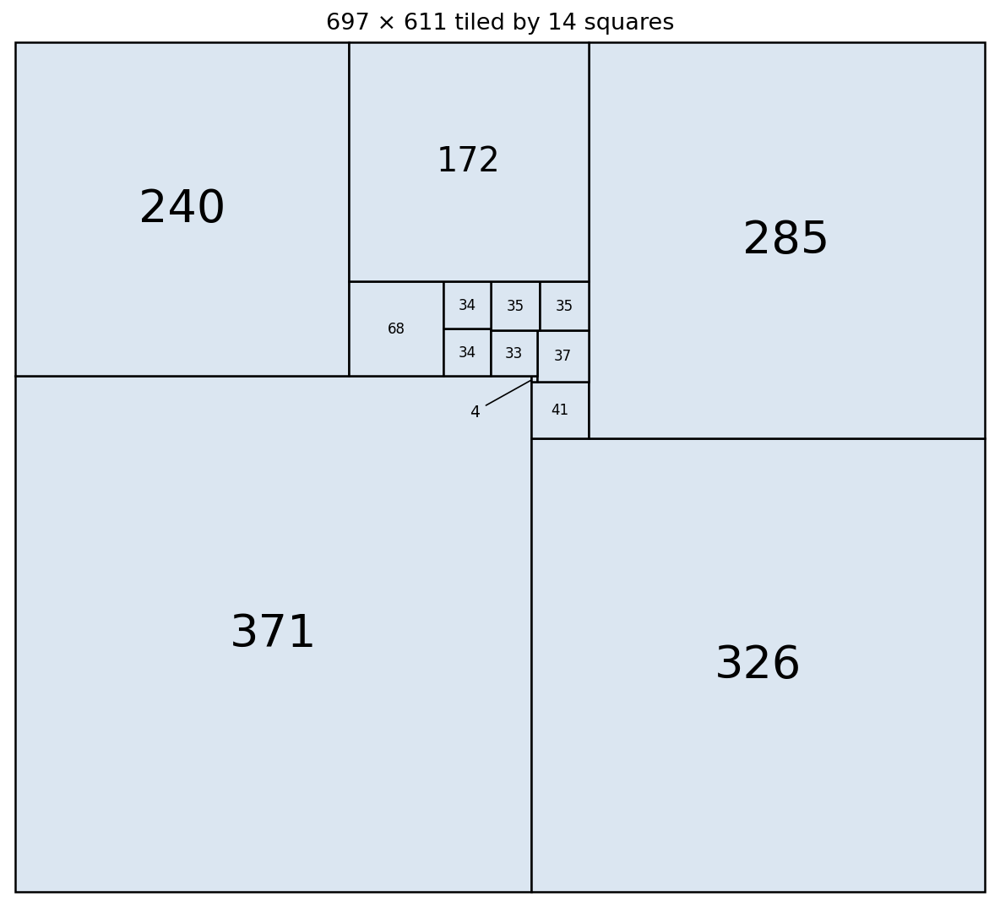

# A 14-square tiling of the 697 × 611 rectangle

Square sides: 371, 326, 285, 240, 172, 68, 41, 37, 35, 35, 34, 34, 33, 4 (areas sum to 697 × 611 = 425,867).

Placements (x, y, side), origin at the bottom-left corner:
(0,0,371) (371,0,326) (371,326,41) (412,326,285) (371,367,4) (375,367,37) (0,371,240) (240,371,68)
(308,371,34) (342,371,33) (342,404,35) (377,404,35) (308,405,34) (240,439,172)

Context: [MathOverflow q/116382](https://mathoverflow.net/q/116382).
